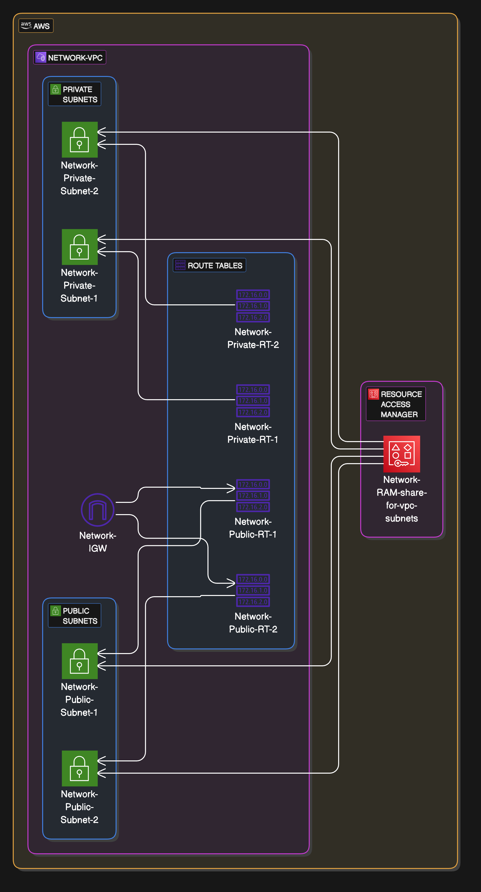

# Central VPC Deployment using Terraform

This project uses the network account of the organization in AWS to create a centralized VPC with Terraform including four subnets (two public and two private subnets), corresponding route tables, route table associations and an internet gateway associated with the two public subnets.

The network account is based on the [AWS Security Reference Architecture](https://docs.aws.amazon.com/prescriptive-guidance/latest/security-reference-architecture/network.html) and is used to host networking resources.

The resources created in this account are shared across other AWS accounts in a [multi-account environment](https://docs.aws.amazon.com/prescriptive-guidance/latest/migration-aws-environment/building-landing-zones.html#aws-control-tower) using the Resource Access Manager (RAM).

In this particular case, the resources of the network account are shared with the sandbox account.

## AWS Resource Access Manager

AWS Resource Access Manager (AWS RAM) helps you securely share your resources across AWS accounts, within your organization or organizational units (OUs) and with AWS Identity and Access Management (IAM) roles and users for supported resource types.

**Benefits of AWS RAM**
- Reduces your operational overhead
- Provides security and consistency
- Provides visibility and auditability

## Infrastructure Diagramm

The following diagram gives a rough overview.

